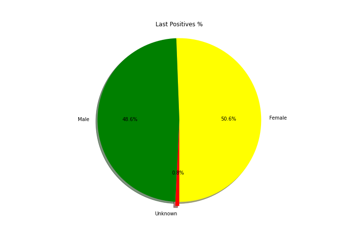
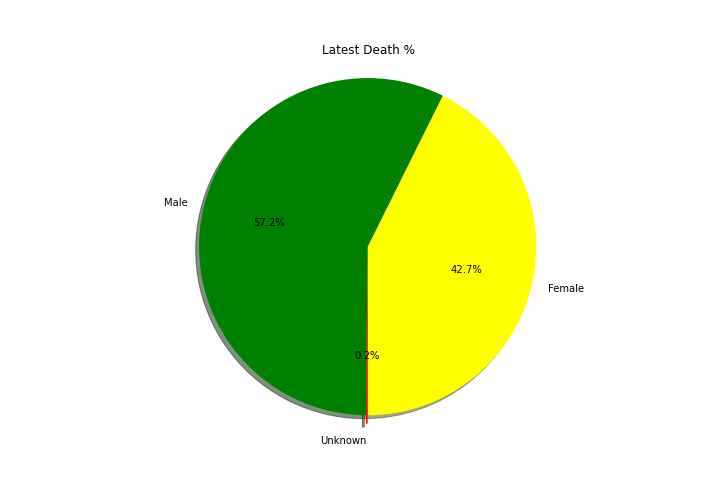
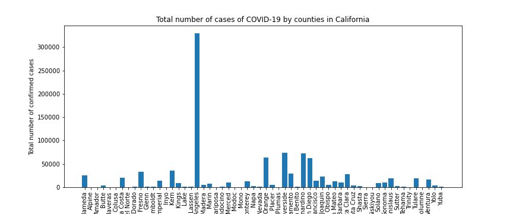
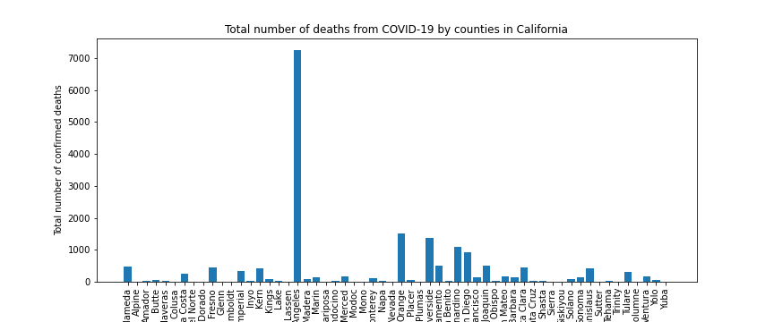
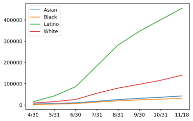
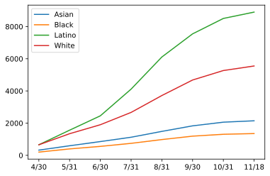
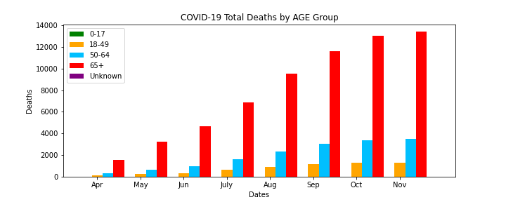
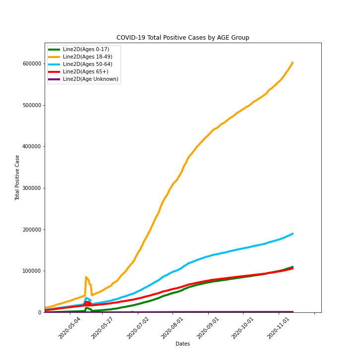

# COVID_analysis

This is a project where we look at COVID-19 datasets:

The data is pulled in as a csv from the website data.ca.gov, then csvs are converted into Pandas data frames, the data frames are cleaned up, then we provide visualiztions.

We breakdown the COVID-19 statistics in California by looking at 4 main topics:

Cases and deaths by gender

Cases and deaths by county

Cases and deaths by ethnicity

Cases and deaths age

